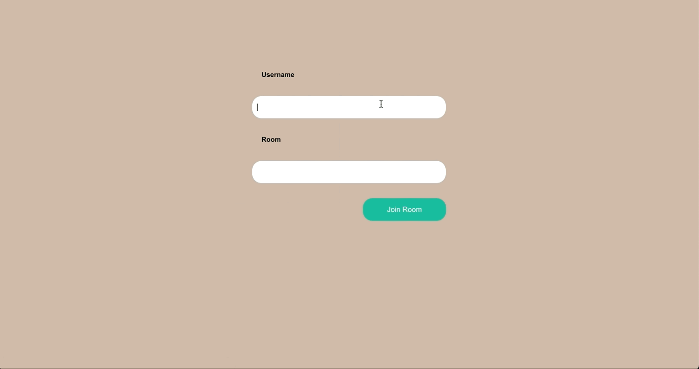

# Simple WebRTC React app
A simple 1-to-1 video call app with the power of WebRTC API.

Refer this blog ["Build your first WebRTC app with Python and React"](https://www.100ms.live/blog/python-react-webrtc-app) on 100ms blogs for info on how to create this app.

:rocket: Check out the deployed app [here](https://coder-with-a-bushido.github.io/simple-webrtc-react-app/)

This app uses a signaling server which is written [here](https://github.com/coder-with-a-bushido/simple-signaling-server).
